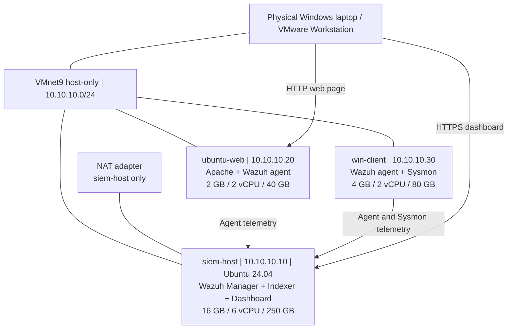

# Mini-SOC Week 1 — Network Diagram

```mermaid
flowchart TB
    Host["Physical Windows laptop / VMware Workstation"]
    Net["VMnet9 host-only | 10.10.10.0/24"]
    Siem["siem-host | 10.10.10.10 | Ubuntu 24.04\nWazuh Manager + Indexer + Dashboard\n16 GB / 6 vCPU / 250 GB"]
    Web["ubuntu-web | 10.10.10.20\nApache + Wazuh agent\n2 GB / 2 vCPU / 40 GB"]
    Win["win-client | 10.10.10.30\nWazuh agent + Sysmon\n4 GB / 2 vCPU / 80 GB"]
    Internet["NAT adapter\nsiem-host only"]
    Host --- Net
    Net --- Siem
    Net --- Web
    Net --- Win
    Internet --- Siem
    Web -->|Agent telemetry| Siem
    Win -->|Agent and Sysmon telemetry| Siem
    Host -->|HTTPS dashboard| Siem
    Host -->|HTTP web page| Web
```

Event path: Endpoint event → Wazuh Agent → Wazuh Manager rules → Indexer → Dashboard alert. Only rule-matching events necessarily result in alerts.
